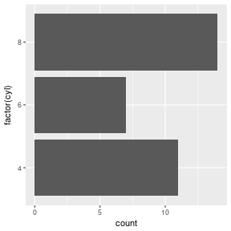

# Midterm study guide: R only

*STS198: Spring 2017*

You should be familiar with all the functions we have covered in
class:

  * ls()
  * head()
  * tail()
  * length()
  * unique()
  * table()
  * sort()
  * summary()
  * which()
  * c()
  * paste()
  * "==" (logical comparison)
  * "[" (subset)
  * names(), colnames(), rownames()
  * subset()
  * !=
  * \>= 
  * <= 
  * \&
  * |
  * tapply()
  * ggplot()
	- geom_histogram()
	- geom_boxplot()
	- geom_points()
	- geom_density()
	- geom_violin()
	- geom_bar()
	- geom_smooth()

### You should be able to answer questions such as:


```r
x = c(1,3,5,9)
```

  * What does \texttt{x[4]} equal?
  
  * How many elements are in the output of \texttt{x == 5}?
  
  * What data type is \texttt{x}? (numeric, logical, character)
  
  * What is the result of \texttt{x[x >= 5]}?
  

```r
str(mtcars)  
```

```
## 'data.frame':	32 obs. of  11 variables:
##  $ mpg : num  21 21 22.8 21.4 18.7 18.1 14.3 24.4 22.8 19.2 ...
##  $ cyl : num  6 6 4 6 8 6 8 4 4 6 ...
##  $ disp: num  160 160 108 258 360 ...
##  $ hp  : num  110 110 93 110 175 105 245 62 95 123 ...
##  $ drat: num  3.9 3.9 3.85 3.08 3.15 2.76 3.21 3.69 3.92 3.92 ...
##  $ wt  : num  2.62 2.88 2.32 3.21 3.44 ...
##  $ qsec: num  16.5 17 18.6 19.4 17 ...
##  $ vs  : num  0 0 1 1 0 1 0 1 1 1 ...
##  $ am  : num  1 1 1 0 0 0 0 0 0 0 ...
##  $ gear: num  4 4 4 3 3 3 3 4 4 4 ...
##  $ carb: num  4 4 1 1 2 1 4 2 2 4 ...
```

```r
head(mtcars)
```

```
##                    mpg cyl disp  hp drat    wt  qsec vs am gear carb
## Mazda RX4         21.0   6  160 110 3.90 2.620 16.46  0  1    4    4
## Mazda RX4 Wag     21.0   6  160 110 3.90 2.875 17.02  0  1    4    4
## Datsun 710        22.8   4  108  93 3.85 2.320 18.61  1  1    4    1
## Hornet 4 Drive    21.4   6  258 110 3.08 3.215 19.44  1  0    3    1
## Hornet Sportabout 18.7   8  360 175 3.15 3.440 17.02  0  0    3    2
## Valiant           18.1   6  225 105 2.76 3.460 20.22  1  0    3    1
```

  * What is the expected length of \texttt{mtcars\$cyl}?

  * How many rows are there in \texttt{mtcars}? Columns?
  

```r
table(mtcars$cyl)
```

```
## 
##  4  6  8 
## 11  7 14
```
  * How many rows are in the result of \texttt{subset(mtcars, cyl ==
    4)}? How many columns?



  * Which code chunk produced the above plot?
  

```r
ggplot(mtcars, aes(x = factor(cyl))) +
    geom_bar() +
    coord_flip()

ggplot(mtcars, aes(x = factor(cyl),
                   fill = factor(am))) +
    geom_bar() +
    coord_flip()

ggplot(mtcars, aes(x = factor(cyl))) +
    geom_bar() 

ggplot(mtcars, aes(x = cyl)) +
    geom_point(stat = "count")
```


```r
table(mtcars$gear)
```

```
## 
##  3  4  5 
## 15 12  5
```

  * \texttt{sort(table(mtcars\$gear), decreasing = FALSE)[1]} returns?

  * \texttt{sort(table(mtcars\$gear), decreasing = TRUE)[1]} returns?
  
  * Do \texttt{subset(mtcars, cyl == 4 | cyl == 6)} and \texttt{subset(mtcars,
    cyl \%in\% c(4,6))} return the same thing?
	
  * Do \texttt{subset(mtcars, cyl == 6)} and \texttt{subset(mtcars,
    cyl == "6")} return the same thing?
	
